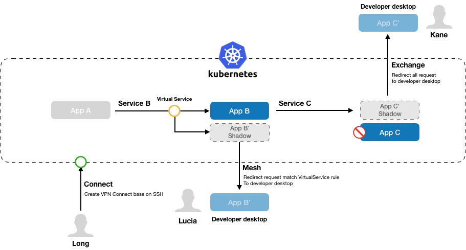

KT-Connect
===========

[English](./README.md) | 简体中文

KtConnect（全称Kubernetes Toolkit Connect）是一款基于Kubernetes环境用于提高本地测试联调效率的小工具。

## ✅ 特性

* `Connect`：建立数据代理通道，实现本地服务直接访问Kubernetes集群内网（包括Pod IP和Service域名）
* `Exchange`：让集群服务流量重定向到本地，实现快速验证本地版本和调试排查问题
* `Mesh`：创建路由规则重定向特定流量，实现多人协作场景下互不影响的本地调试
* `Preview`：暴露本地服务到集群，实现无需发布即可在线预览集成效果

## 🚀 快速开始

您可以从[下载](docs/zh-cn/guide/downloads.md)页面安装最新的`ktctl`命令行工具。

花10分钟阅读[快速开始](docs/zh-cn/guide/quickstart.md)文档了解KtConnect的使用方法。

## 💡 寻求帮助

请将遇到的问题描述提交到[Github Issue](https://github.com/alibaba/kt-connect/issues)，或直接加入钉钉群联系项目开发者：

</img>
