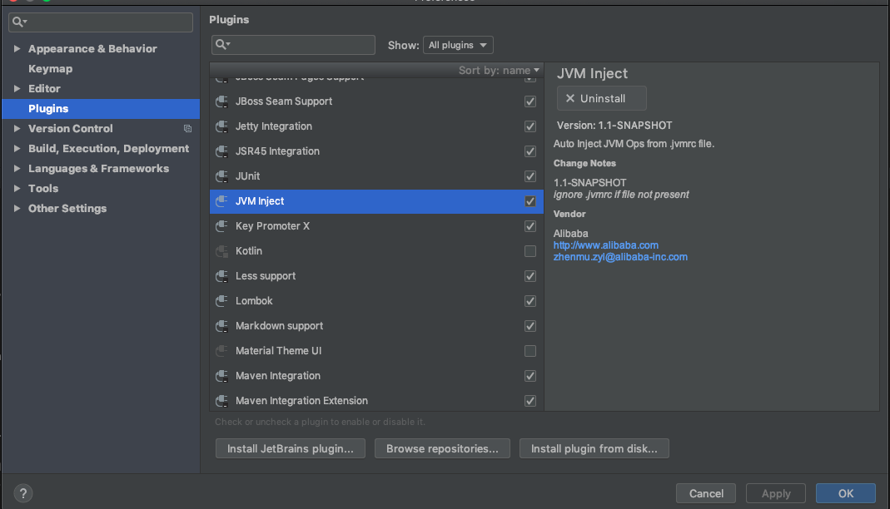

# How To Dev in IDEA

> VPN mode is a global system proxy, this guide is only applicable to `SOCKS5` mode

The latest version of KT Connect0.0.8+[Downloads](https://alibaba.github.io/kt-connect/#/nightly) already support integration with IDEA for Java Developer.

## How to work

### Start Socks5 connect in local

In the IDEA project workspace, use ktctl start a new socks5 connect:

```
sudo ktctl -d connect --method=socks5
```

This command will create .jvmrc that includes all JVM ops should apply to Java application：

```
-DsocksProxyHost=127.0.0.1
-DsocksProxyPort=2223
```

### Install JVM Inject Plugin: Auto Inject .jvmrc content to java run Parameters

Download and Install the lastest version of [JVM Inject](https://plugins.jetbrains.com/plugin/13482-jvm-inject/versions)插件



JVM Inject Plugin will auto read the .jvmrc content from workspace. if present it will append all content to Idea Java Launcher:


```
java ...ignore content... -Djava.rmi.server.hostname=127.0.0.1 -Dspring.liveBeansView.mbeanDomain -Dspring.application.admin.enabled=true -Dhttp.proxyHost=127.0.0.1 -Dhttp.proxyPort=2223 "-javaagent:/Applications/IntelliJ IDEA.app/Contents/lib/idea_rt.jar=58609:/Applications/IntelliJ IDEA.app/Contents/bin" ...ignore content...  sample.Application
```

After this all the network request from this java process with proxy by socks5 proxy create by KT Connect, and then you can directly request to Kubernetes Cluster Service:

```
$ kubectl get svc spring-sample
NAME                   TYPE        CLUSTER-IP     EXTERNAL-IP   PORT(S)    AGE
spring-sample   ClusterIP   172.21.15.36   <none>        8080/TCP   160d
```

For Example:

```java
@RestController
public class HelloController {

    @RequestMapping("/")
    public String index() {
        ResponseEntity<String> response = new RestTemplate().getForEntity("http://172.21.14.10:8080", String.class);
        return response.getBody();
    }

}
```