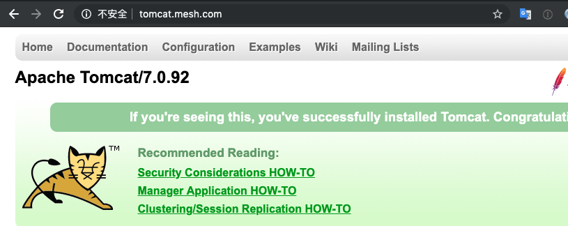
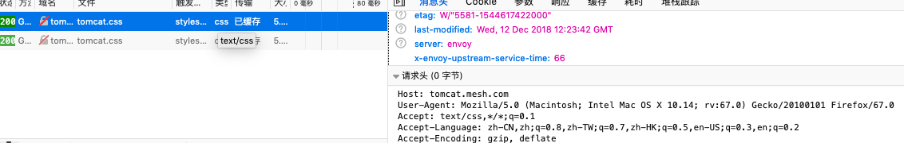

Manual Mesh Example：Development With Istio
---

In this example, we will deploy Tomcat7 in the cluster and access it through the Istio Gateway to join the local joint endpoint via `ktctl mesh` while ensuring that the original link is properly accessible. Finally, modify the Istio routing rules so that only traffic that meets certain rules is forwarded to the local debug endpoint (Tomcat8).

### Prepare Application

> Preconditions, Kubernetes cluster has deployed Istio components

Here is still to use Tomcat as an example to demonstrate the use of `Mesh`.

Create a namespace and enable Istio auto injection:

```
$ kubectl create namespace mesh-demo
$ kubectl label namespace mesh-demo istio-injection=enabled
```

Prepare the application in the cluster:

``` yaml 
#tomcat7-deploy.yaml
apiVersion: v1
kind: Service
metadata:
  name: tomcat
spec:
  ports:
    - port: 8080
      protocol: TCP
      targetPort: 8080
  selector:
    run: tomcat
  sessionAffinity: None
  type: ClusterIP
status:
  loadBalancer: {}
---
apiVersion: apps/v1
kind: Deployment
metadata:
  labels:
    run: tomcat
    version: v1
  name: tomcat
spec:
  selector:
    matchLabels:
      run: tomcat
      version: v1
  template:
    metadata:
      labels:
        run: tomcat
        version: v1
    spec:
      containers:
        - image: 'tomcat:7'
          name: tomcat
          ports:
            - containerPort: 8080
              protocol: TCP
```

Deploy the app:

```
$ kubectl -n mesh-demo apply -f tomcat7-deploy.yaml
service/tomcat created
deployment.apps/tomcat created
```

### Access Application 

Create a default Istio routing rule：

```yaml
#tomcat7-istio.yaml
apiVersion: networking.istio.io/v1alpha3
kind: Gateway
metadata:
  name: tomcat-gateway
spec:
  selector:
    istio: ingressgateway
  servers:
  - hosts:
    - 'tomcat.mesh.com'
    port:
      name: http
      number: 80
      protocol: HTTP
---
apiVersion: networking.istio.io/v1alpha3
kind: DestinationRule
metadata:
  name: tomcat
spec:
  host: tomcat
  subsets:
  - name: v1
    labels:
      version: v1
---
apiVersion: networking.istio.io/v1alpha3
kind: VirtualService
metadata:
  name: tomcat
spec:
  gateways:
  - tomcat-gateway #绑定gateway
  hosts:
  - tomcat.mesh.com
  - tomcat
  http:
  - route:
    - destination:
        host: tomcat
        subset: v1
```

Deploy the Istio resources:

```
$ kubectl -n mesh-demo apply -f tomcat7-deploy.yaml
gateway.networking.istio.io/tomcat-gateway created
destinationrule.networking.istio.io/tomcat created
virtualservice.networking.istio.io/tomcat created
```

Get access to Istio：

```
export INGRESS_HOST=$(kubectl -n istio-system get service istio-ingressgateway -o jsonpath='{.status.loadBalancer.ingress[0].ip}')
export INGRESS_PORT=$(kubectl -n istio-system get service istio-ingressgateway -o jsonpath='{.spec.ports[?(@.name=="http")].port}')
```

Add custom DNS in the local Hosts:

```
# <INGRESS_HOST> tomcat.mesh.com
```

通过域名`http://tomcat.mesh.com`访问实例应用:



### Mesh： adds a local access endpoint

Use the tomcat:8 container locally and listen on the local 8080 port:

```
docker run -itd -p 8080:8080 tomcat:8
```

Add a local joint endpoint:

```
$ ktctl -n mesh-demo mesh tomcat --expose 8080 --mode manual
00:00AM INF KtConnect start at <PID>
... ...
--------------------------------------------------------------
 Now you can update Istio rule by label 'version: ngzlj' 
--------------------------------------------------------------
```

As shown above, a local endpoint is deployed here, and the version number is `ngzlj`. At this point, if you visit `http://tomcat.mesh.com`, you can access tomcat7 normally.

### Define local endpoint access rules

Modify the path rules and make sure that when accessing with Firefox, traffic is transferred to Tomcat8 running locally, as shown below：

```yaml
apiVersion: networking.istio.io/v1alpha3
kind: DestinationRule
metadata:
  name: tomcat
spec:
  host: tomcat
  subsets:
  - name: v1
    labels:
      version: v1
  - name: ngzlj # 添加本地端点版本
    labels:
      version: ngzlj
---
apiVersion: networking.istio.io/v1alpha3
kind: VirtualService
metadata:
  name: tomcat
spec:
  gateways:
  - tomcat-gateway
  hosts:
  - tomcat.mesh.com
  - tomcat
  http:
  - match: # 定义路由规则
    - headers: 
        user-agent: # 匹配请求的user-agent
          exact: Mozilla/5.0 (Macintosh; Intel Mac OS X 10.14; rv:67.0) Gecko/20100101 Firefox/67.0
    route:
    - destination:
        host: tomcat
        subset: ngzlj
  - route:
    - destination:
        host: tomcat
        subset: v1
```

At this point, if you access the service through the Firefox browser, you can access the local Tomcat: 8 instance:


Accessing the application through a non-Firefox browser will give you access to the original Tomcat:7 application:


Note: User-agent can be viewed through Firefox's browser development tool as follows:

